# HEBI MoveIt Configurations

This repository provides MoveIt configurations for HEBI standard arm kits.

## Running the HEBI MoveIt Examples

Please refer to the documentation on the `hebi_ros2_example` repository: [https://github.com/HebiRobotics/hebi_ros2_examples](https://github.com/HebiRobotics/hebi_ros2_examples).

## Create MoveIt Configuration Package

Before generating MoveIt configurations, ensure you have the following:

*   **URDF File:** A URDF file for the HEBI Kit you intend to use.  URDFs for standard HEBI arm kits are available in the `hebi_description` repository: [https://github.com/HebiRobotics/hebi_description](https://github.com/HebiRobotics/hebi_description).  Note that the `master` branch of `hebi_description` is intended for ROS 1.  For ROS 2, select the appropriate branch in the repository.
*   **Non-Standard HEBI Kit:** If you are using a non-standard HEBI kit, a script is provided in the `hebi_description` repository to convert HRDF to URDF.
*   **MoveIt Installation:** You need to have MoveIt installed to proceed with the configuration generation.

To start the MoveIt Setup Assistant, use the following command:
```
ros2 run moveit_setup_assistant moveit_setup_assistant
```

This will open the MoveIt Setup Assistant window.

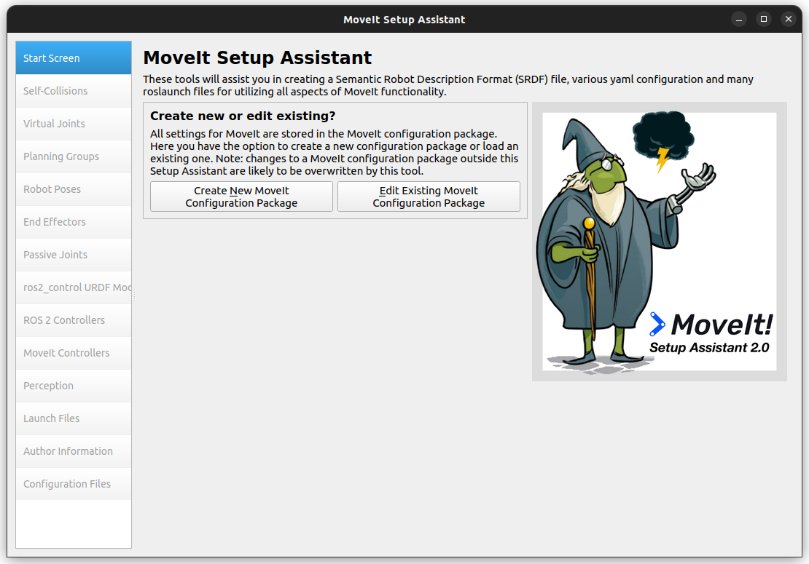

## Configuration Steps

The following steps closely follow the official MoveIt tutorial ([https://moveit.picknik.ai/main/doc/examples/setup_assistant/setup_assistant_tutorial.html](https://moveit.picknik.ai/main/doc/examples/setup_assistant/setup_assistant_tutorial.html)). Refer to the linked tutorial for more detailed information on each step.

Other Reference: https://automaticaddison.com/complete-guide-to-the-moveit-setup-assistant-for-moveit-2/

### 1. Load File

Click on the "Create New MoveIt Configuration Package" button and load the URDF xacro file. Finally, click on the "Load Files" button to proceed.
Once the files are loaded, you will see the following:

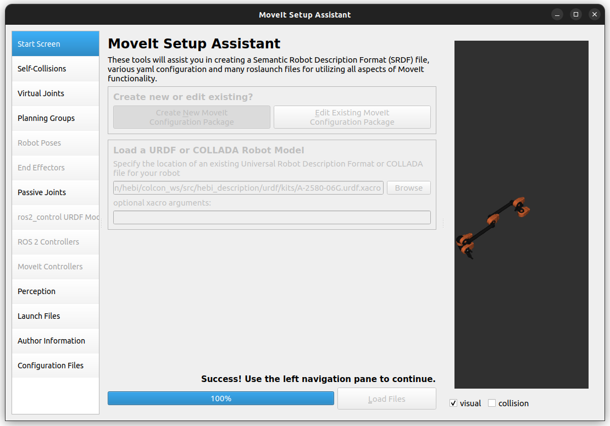

### 2. Self-Collisions

Click on "Self-Collisions" on the sidebar, and then click on the "Generate Collision Matrix" button after choosing an appropriate Sampling Density. For standard arm kits, this was set to 30000. This will generate the collision matrix for your arm.

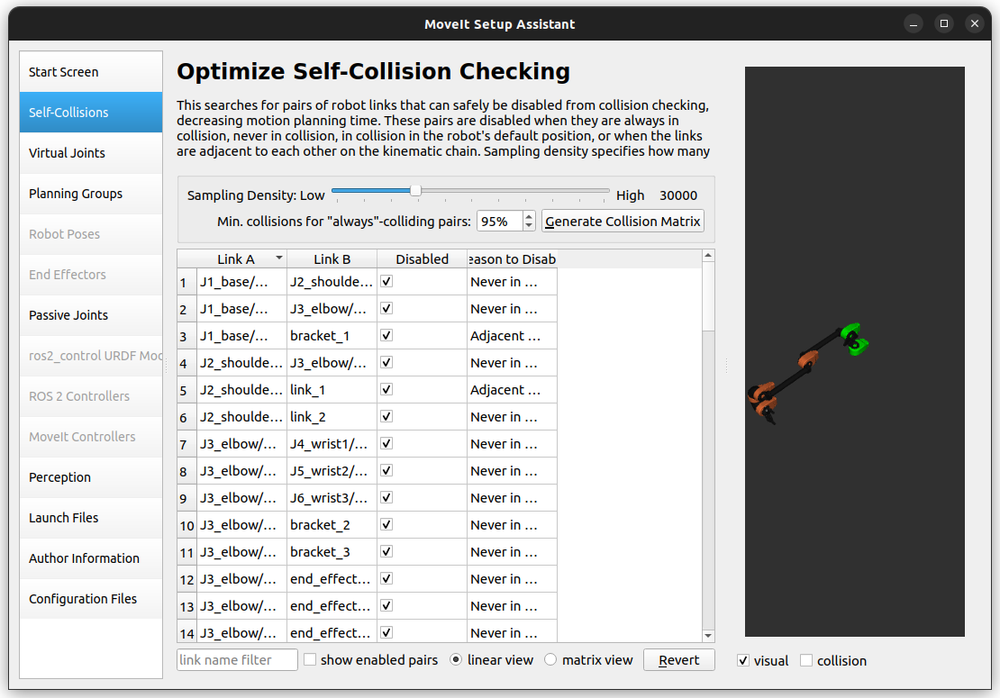

### 3. Virtual Joints

Click on the "Add Virtual Joint" button to add a virtual joint from the world to the `base_link` of your arm. Name the virtual joint as `virtual_joint`. Choose the `Child Link` as `base_link` and type `world` in the `Parent Frame Name`. Keep the `Joint Type` as fixed, and click on the "Save" button.

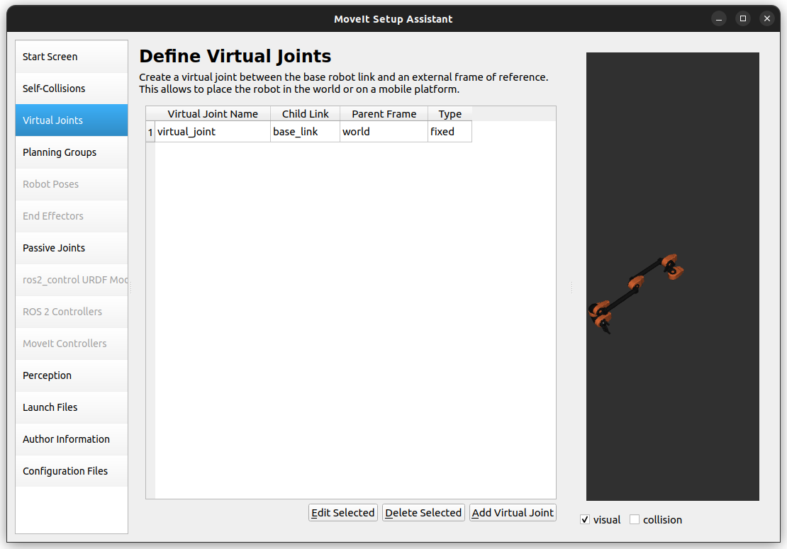

### 4. Planning Groups

Click on "Planning Groups" on the sidebar, and then click on the "Add Group" button to add a planning group for your arm. Name the planning group as `hebi_arm`. Choose the kinematics solver as desired; for standard kits, use `kdl_kinematics_plugin/KDLKinematicsPlugin`, which is also the default in MoveIt. Leave the remaining fields as default.

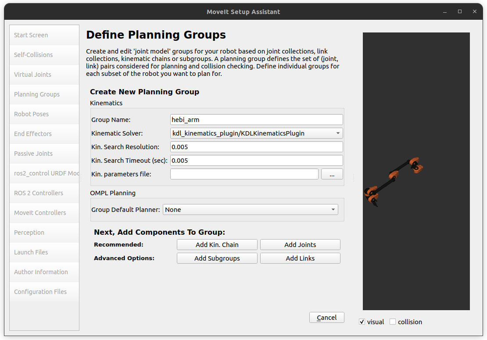

Now, click on the "Add joints" button to add the joints of your arm to the planning group. Select all the joints from `virtual_joint` till the last actuator joint by pressing **Shift** and clicking on the last actuator joint. Then, click on the `>` button to add them to the Planning Group. Finally, click "Save".

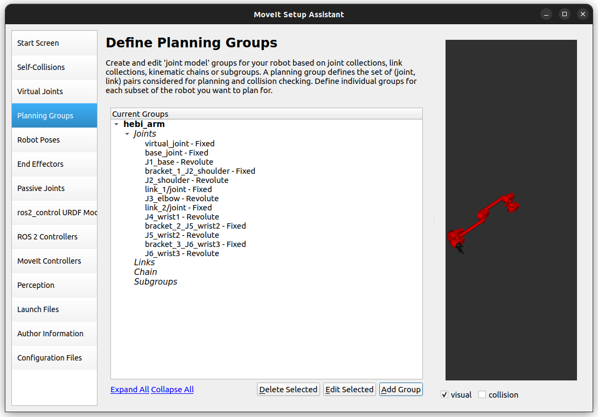

#### Additional Planning Groups for Grippers

If you have a gripper, add two more planning groups: `gripper` and `hebi_arm_with_gripper`.

- **Gripper Group:** Click on "Add Group", name it `gripper`, and click on "Add Links". Select all the links **after** the last link connected to the arm (e.g., `end_effector_1` in standard kits). Click on the `>` button to add them, and then click on the "Save" button.
  
- **hebi_arm_with_gripper Group:** Click on "Add Group" again, name it `hebi_arm_with_gripper`, and select the same kinematic solver as for `hebi_arm`. Click on "Add Subgroups", select both `hebi_arm` and `gripper` subgroups, and add them by clicking the `>` button. Finally, click on the "Save" button.

After these steps, you should have three planning groups and look similar to the following:

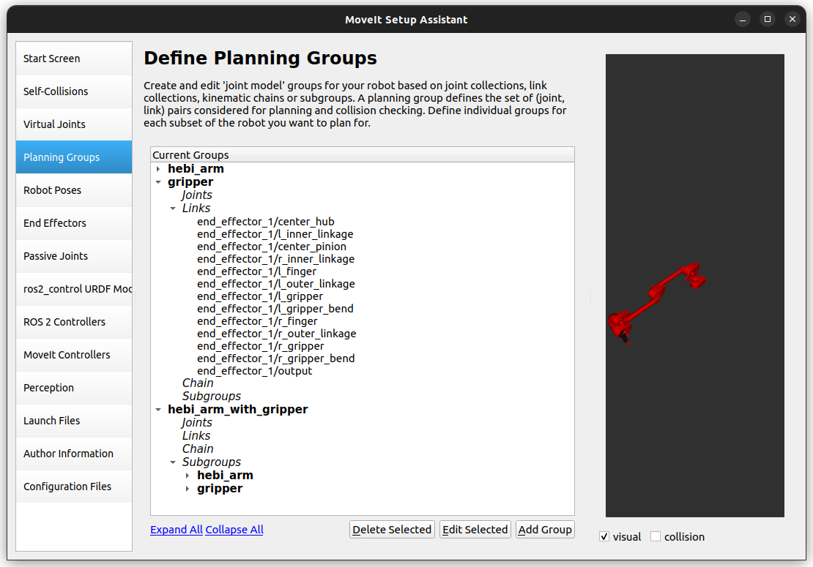

### 5. Robot Poses

Click on "Robot Poses" on the sidebar, and click on the "Add Pose" button to add a robot pose for your arm. For standard kits without grippers, you can skip this step. However, it is useful for verifying joint movements.

If you have a gripper, add two positions: `open` and `closed`. To do so, click on "Add Pose", name the pose as `open`, select `gripper` as the planning group, and set `0.0` for the end-effector joint. Repeat this process with the end-effector joint set to its highest value to add a `closed` pose.

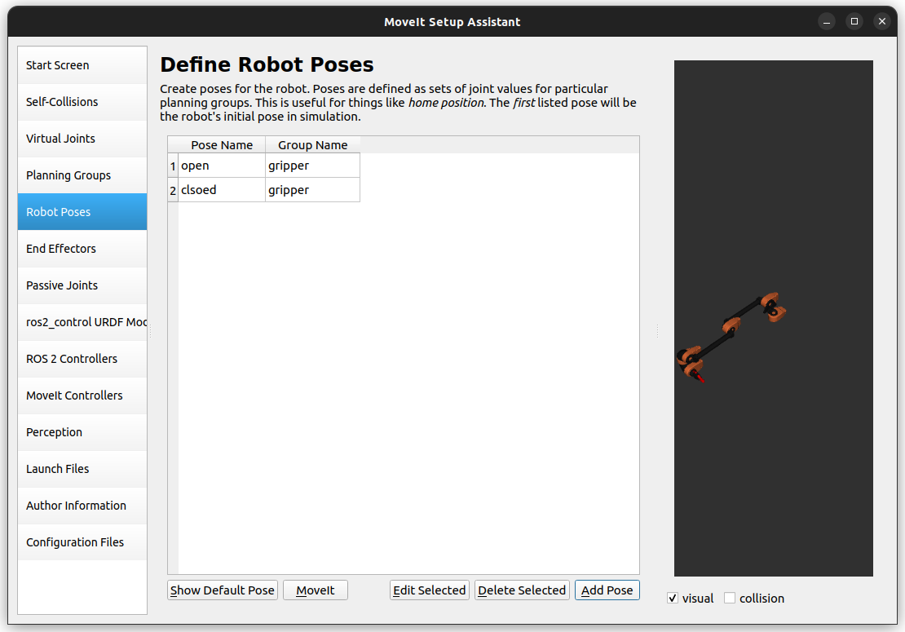

### 6. End Effectors

Click on "Add End Effector", name it as `gripper`, select the group as `gripper`, and set its parent link as the last link connected to the arm (e.g., `end_effector_1` in standard kits). Leave the Parent Group empty, and click "Save".

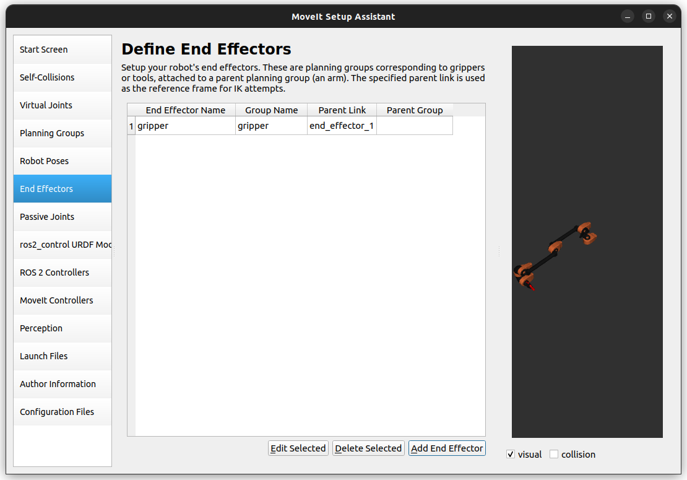

### 7. Passive Joints

If you have any passive joints (not actuated), you can add them in this section. HEBI kits typically do not have passive joints, so you can skip this step.

### 8. ros2_control URDF Modifications

In this section, turn on the checkbox for `velocity` in the Command Interfaces section, and click on "Add interfaces".

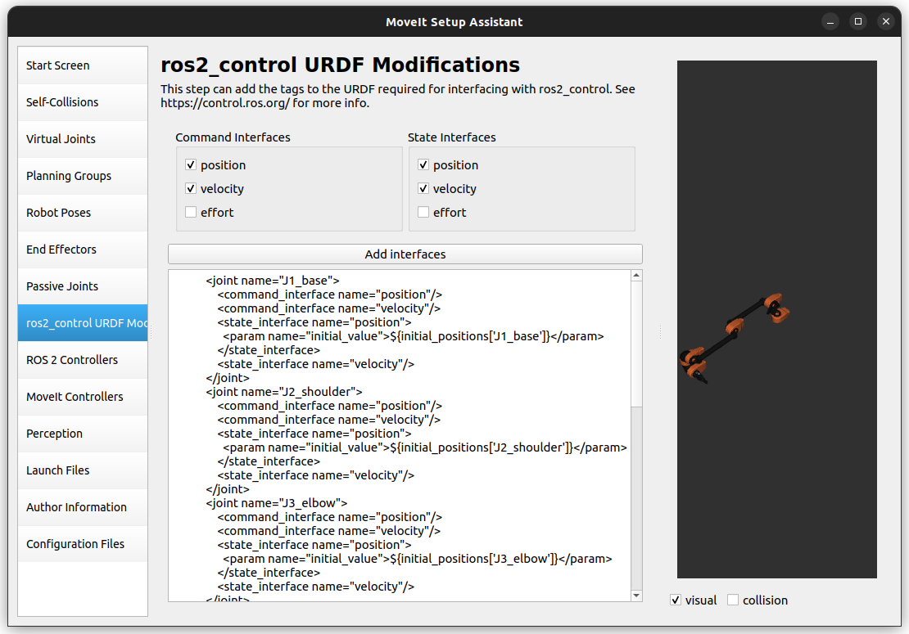

### 9. ROS 2 Controllers

Click on the "Auto Add JointTrajectoryController Controllers For Each Planning Group" button. This will add the necessary ROS 2 controllers for your arm.

If you have a gripper and followed the exact steps for adding Planning Groups, the auto-generation process will create three controllers. Modify the generated controllers as follows:
- **Delete** the `hebi_arm_with_gripper_controller`.
- **Edit** the `gripper_controller` and select the controller type as `position_controllers/GripperActionController`.

After these modifications, your controller configuration should look like this:

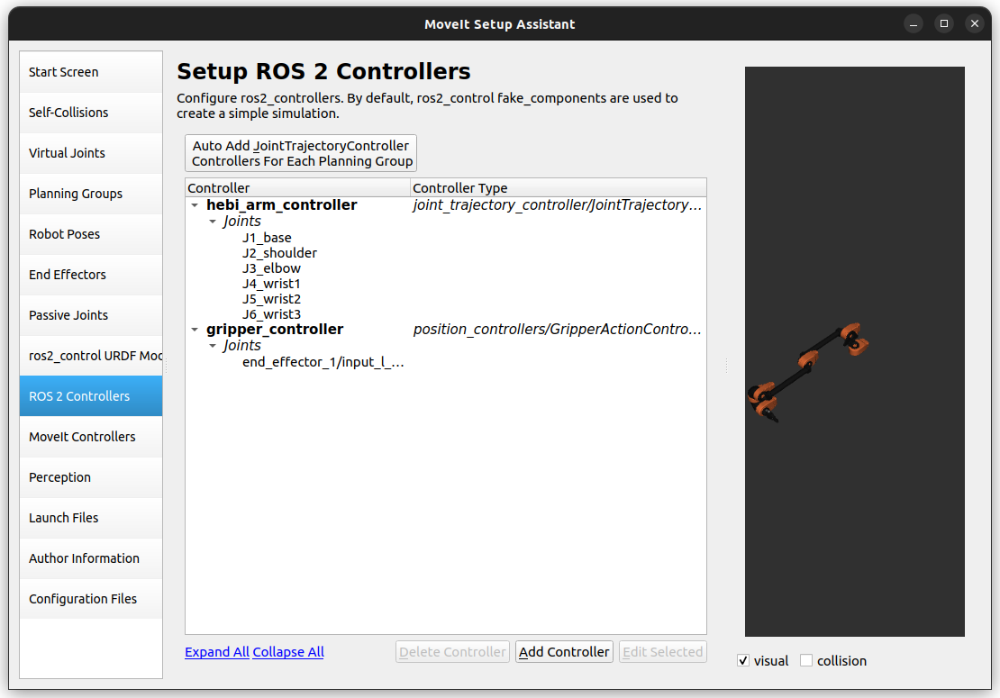

### 10. MoveIt Controllers

Click on the "Auto Add FollowJointsTrajectory Controllers For Each Planning Group" button. This will add the necessary MoveIt controllers for your arm.

If you have a gripper, similar to the previous step:
- **Delete** the `hebi_arm_with_gripper_controller`.
- **Edit** the `gripper_controller` with `GripperCommand` as the controller type.

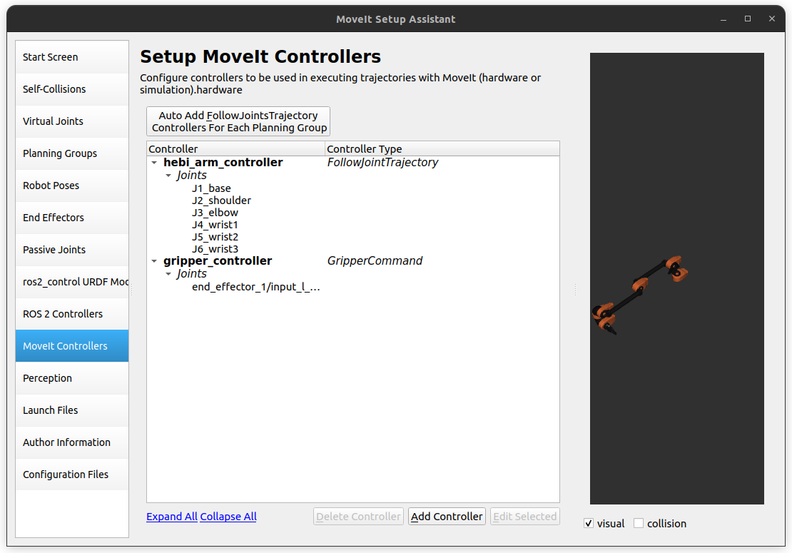

### 11. Perception

Skip this step unless you want to configure settings for a depth camera.

### 12. Launch Files

You can skip this step unless you want to remove some launch files.

### 13. Author Information

Fill in the necessary details.

### 14. Configuration Files

Select the desired output directory. Note that the files will be placed directly in the selected directory, not in a new subdirectory, so choose a directory matching the convention such as `<your_robot_name>_moveit_config`. Click on the "Generate Package" button to generate the MoveIt configuration package for your arm.

Once the package is generated, you will see a confirmation window,  similar to the one shown below:

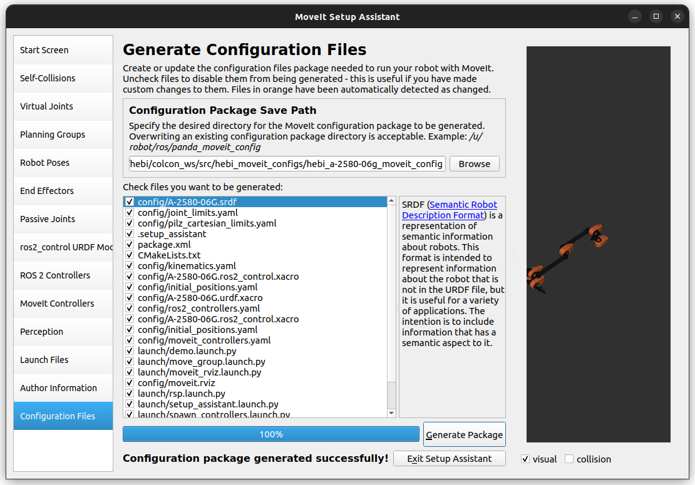

Click on the "Exit Setup Assistant" button to exit the MoveIt Setup Assistant.

### Manual Edits to Configuration Files

- There is a bug in the setup assistant that does not add `action_ns` and `default` parameters to the controllers in the `moveit_controllers.yaml` file if you auto-generated the MoveIt Controllers. In case you do not see them, add them manually as:
```
action_ns: follow_joint_trajectory (for hebi_arm_controller) or gripper_cmd (for gripper_controller)
default: true
```

- Sometimes, MoveIt throws an error when there are no acceleration limits set for the joints. So, manually set `has_acceleration_limits` to `true` and set an appropriate value for `max_acceleration`.

- MoveIt also throws an error when the values for `max_acceleration` and `max_velocity` are not doubles (unless they are `0`). So, add `.0` to the end of the values if they are integers.

### Testing

To test the MoveIt configuration, run the following command:
```
ros2 launch <your_robot_name>_moveit_config demo.launch.py
```
**NOTE:** Do not forget to build your workspace and source your setup before running the above command.

If the launch is successful, a RViz window opens up with the arm and a GUI to control the arm. To check if MoveIt is able to plan and execute trajectories, click on the "Planning" tab on the left sidebar, choose "random valid" as the GoalState, and click on the "Plan and Execute" button. This will plan and execute the trajectory, and you should see the arm move to the goal position.

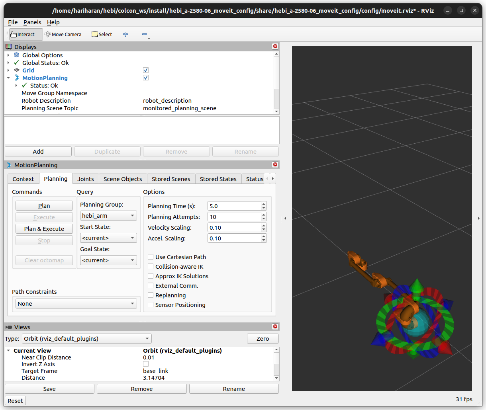